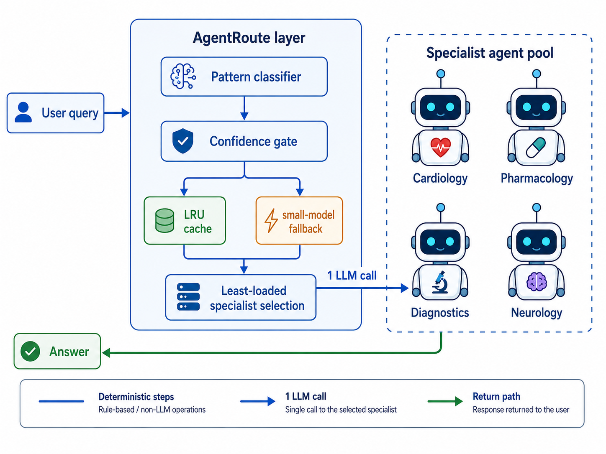

# AgentRoute

**Communication mitigation in LLM multi-agent systems via deterministic, training-free routing.**

AgentRoute is a thin communication layer that routes each query to a single
specialist agent using a pattern-based domain classifier, an LRU result cache,
and an optional small-model fallback for low-confidence queries. It issues
**exactly one LLM call per resolved query**, uses **no learned components**, and
requires **no training**. The design adapts the location-aware addressing and
middle-agent matchmaking of the Actor Architecture (Jang et al., 2005) to the LLM
setting.



> **Status: work in progress.** Code is functional and validated; the manuscript
> (EMNLP Industry Track) is under preparation. Numbers below are from current
> runs and may be refined before submission.

---

## Highlights

- **One LLM call per query.** AgentRoute dispatches to a single specialist; the
  routing decision itself is deterministic and issues no LLM call when pattern
  confidence is high.
- **Matches accuracy at a fraction of the cost.** On MedQA, AgentRoute is
  statistically indistinguishable from the multi-call routers on accuracy while
  cutting latency and per-query cost by large, significant margins.
- **Dominates on a production backbone.** Against Claude Haiku 4.5, AgentRoute is
  simultaneously the most accurate, fastest, and cheapest router evaluated.
- **Fair on multi-hop QA.** On HotpotQA—where a retrieval corpus is available and
  the multi-hop routers operate in their native regime—AgentRoute ties the best
  router on exact match and remains the cheapest and fastest, trading a modest
  F1 gap for much lower cost.
- **Flat communication cost as the agent pool grows.** Messages per query are
  constant in pool size *N*; at *N*=200, AgentRoute exchanges 1 message versus a
  broadcast baseline's 200 (a 99.5% reduction).
- **Auditable and reproducible.** Every routing decision is a deterministic
  function of the query and a keyword inventory, replayable offline without an
  LLM.

---

## Results at a glance

### MedQA (Qwen2.5-3B, 100 problems x 3 seeds)

| Router | Accuracy | Latency (s) | LLM calls |
|---|---|---|---|
| **AgentRoute** | **0.653** | **1.15** | **1.0** |
| RCR-Router | 0.670 | 13.46 | 8.52 |
| OI-MAS | 0.537 | 3.23 | 2.35 |
| EvoMAS | 0.477 | 3.11 | 1.61 |
| RopMura | 0.300 | 6.38 | 5.03 |

AgentRoute matches the multi-call routers on accuracy at the lowest latency and
cost. (RCR-Router is designed for retrieval-augmented multi-hop QA; on closed-book
MedQA it emulates that pipeline without a corpus, so its result is reported for
context only.)

### Production deployment (Claude Haiku 4.5, 50 problems x 3 seeds)

| Router | Accuracy | Latency (s) | Cost/query | LLM calls |
|---|---|---|---|---|
| **AgentRoute** | **0.847** | **2.29** | **$0.0009** | **1.0** |
| OI-MAS | 0.573 | 6.01 | $0.0030 | 2.49 |
| EvoMAS | 0.547 | 4.59 | $0.0022 | 1.77 |
| RopMura | 0.240 | 10.21 | $0.0050 | 5.03 |
| DyTopo | 0.187 | 27.20 | $0.0153 | 12.29 |

On a more capable backbone, the single-call design moves from a favourable
accuracy-cost trade-off to dominance on all four metrics.

### Multi-hop QA (HotpotQA distractor, Qwen3-4B, 80 problems x 4 seeds)

| Router | EM | F1 | Latency (s) | LLM calls |
|---|---|---|---|---|
| **AgentRoute** | **0.503** | 0.599 | **1.07** | **1.0** |
| RCR-Router | 0.503 | **0.649** | 2.39 | 4.0 |
| OI-MAS | 0.500 | 0.603 | 1.67 | 2.0 |
| EvoMAS | 0.475 | 0.557 | 1.89 | 1.87 |
| RopMura | 0.441 | 0.591 | 2.41 | 6.76 |

With a corpus available, the multi-hop routers recover: RCR-Router leads on F1.
AgentRoute ties on EM and stays the fastest and cheapest. Latency and cost
differences against every baseline are Bonferroni-significant.

### Scalability (MedQA, N in {10, 50, 100, 200})

Messages per query are flat in pool size for every selective router (AgentRoute
1.0, EvoMAS 1.73, OI-MAS 2.33, RopMura 5.11), while a broadcast baseline grows
linearly with *N*. AgentRoute's routing-decision latency stays near 1.6 ms across
the sweep; RopMura's rises from 8.8 to 11.2 ms.

---

## Routers compared

All routers share a single LLM backbone per experiment, so only routing behaviour
differs:

| Router | Description |
|---|---|
| **AgentRoute** | Deterministic pattern routing + LRU cache, one LLM call (this work) |
| OI-MAS | Confidence-aware role/model routing with a verifier |
| RCR-Router | Role-aware context routing (Planner / Searcher / Recommender) |
| EvoMAS | Evolutionary multi-agent configuration search |
| DyTopo | Dynamic communication topology via semantic matching |
| RopMura | Four-submodule planner with cluster-embedding routing |

Baselines are re-implemented to follow each method's published architecture; see
`paper/references.bib` for citations.

---

## Repository layout

```
.
|-- agentroute_jang2005_complete.py   # AgentRoute core: pattern classifier, LRU cache, registry
|-- medqa_evaluation.py               # MedQA benchmark + the 6-router comparison library
|-- hotpotqa_evaluation.py            # HotpotQA multi-hop QA (Qwen3-4B backbone)
|-- production_casestudy.py           # Claude API production case study (rate limits, budget cap)
|-- scalability_sweep.py              # Agent-pool sweep: message volume + routing latency vs N
|-- concurrent_load_test.py           # Async QPS stress test: p50/p95/p99 tail latency
|-- requirements.txt
|-- results/
|   `-- figures/
|       |-- fig_arch.png              # Architecture diagram (shown above)
|       |-- fig_casestudy.pdf         # Production case study metrics
|       `-- fig_scalability.pdf       # Messages per query vs N
`-- paper/
    `-- references.bib
```

`medqa_evaluation.py` is the shared library: it defines the router
implementations and MCQ helpers that the other scripts import. Keep all Python
files in the same directory—they import each other by module name from the
repository root.

---

## Quick start

```bash
pip install -r requirements.txt

# Smoke test (a few minutes on one GPU): confirms the pipeline end-to-end
python medqa_evaluation.py --num_problems 10 --runs 1 --seeds 13
```

A 16 GB GPU is sufficient for the default Qwen2.5-3B backbone. HotpotQA uses
Qwen3-4B (needs transformers >= 4.51) and benefits from a 24 GB+ GPU. The Claude
case study requires `ANTHROPIC_API_KEY` and incurs API cost. Each script has a
`HOW TO RUN` block at the bottom with smoke-test and full-run commands.

---

## Reproducibility

- Every script seeds `random`, `numpy`, and `torch`; seeds are command-line
  arguments and recorded in each output row.
- Statistical analyses (paired t-tests vs AgentRoute, Cohen's d, 95% CIs,
  Bonferroni correction, Friedman test) are computed inside the scripts and
  written to CSV.
- Backbones: `Qwen/Qwen2.5-3B-Instruct` (MedQA, scalability),
  `Qwen/Qwen3-4B-Instruct-2507` (HotpotQA), `claude-haiku-4-5` (case study).
- Result files (`*.json`, `*.csv`) are regenerated by running the scripts.

## License

Released under the Apache License 2.0. See [`LICENSE`](LICENSE) for the full
text.